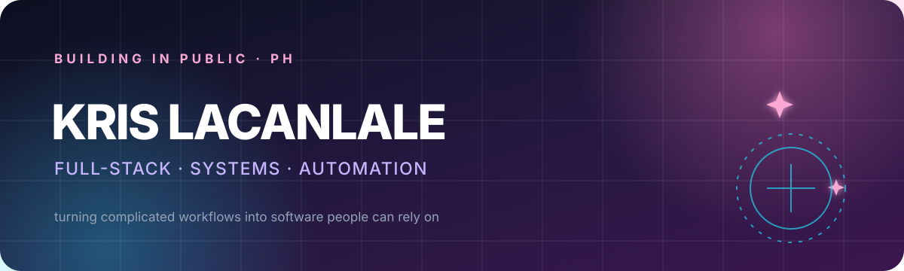

<p align="center">
  
</p>

<p align="center">
  <strong>Senior Full-Stack Software Engineer · Systems Administrator · Builder in Public</strong>
</p>

<p align="center">
  I turn messy workflows into dependable software—with a little soft-cyber energy ✦
</p>

<p align="center">
  
  
  
  
  
  
</p>

## ✦ What I build

- Full-stack products with **Next.js, React, TypeScript, Node.js, and Python**
- Business systems using **Frappe Framework and ERPNext**
- Reliable infrastructure with **Docker, Linux, Nginx, AWS, and Proxmox**
- Practical automations using **n8n, APIs, and AI-assisted workflows**

## ♡ 100 Days of Code

One small, original project built in public each day—working code, documentation, and tests when applicable. No client code, copied tutorials, empty placeholders, or contribution farming.

**Progress:** Day 003 of 100 · August 31–December 8, 2026

| Day | Project | Focus |
| --- | --- | --- |
| 001 | [Commit Craft](./daily-builds/day-001-commit-craft) | JavaScript modules, validation, browser APIs, and Node tests |
| 002 | [JSON Lens](./daily-builds/day-002-json-lens) | JSON parsing, recursive paths, search filtering, and Node tests |\n| 003 | [Markdown Split View](./daily-builds/day-003-markdown-split-view) | Safe Markdown parsing, browser state, responsive UI, and Node tests |

[Browse the 100 Days of Code collection →](./daily-builds)

## ⚡ Current mode

```text
building  → small tools with real utility
learning  → better tests, CI/CD, and system design
sharing   → honest work without exposing private client code
```

## ☁ Connect

- [Portfolio](https://krislacanlale.com)
- [Selected work](https://krislacanlale.com/projects)
- [LinkedIn](https://www.linkedin.com/in/kris-lacanlale-54265838/)
- [Repositories](https://github.com/malditha?tab=repositories)

<p align="center">
  <em>build softly · ship bravely · improve daily</em> ✦
</p>
